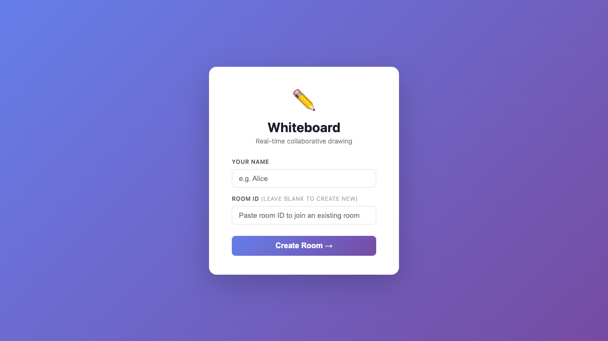
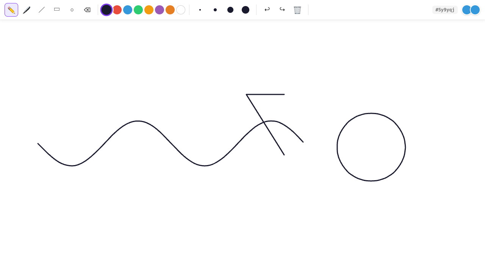

# Whiteboard App

A real-time collaborative whiteboard built with React, Socket.IO, and Rough.js.

## Screenshots

### Landing Page


### Whiteboard Canvas


## Features

- Real-time collaboration — multiple users can draw simultaneously in the same room
- Freehand drawing with smooth brush strokes
- Shape tools: line, rectangle, ellipse
- Eraser tool
- Color palette and stroke size controls
- Undo / Redo
- Room system — create or join rooms with a shared room ID
- Persistent drawings via MongoDB
- User presence indicators

## Tech Stack

| Layer | Technology |
|---|---|
| Frontend | React 19, Vite |
| Drawing | Rough.js, HTML5 Canvas |
| Real-time | Socket.IO |
| State | Zustand |
| Backend | Node.js, Express |
| Database | MongoDB |

## Getting Started

### Prerequisites

- Node.js 18+
- MongoDB running locally (`mongodb://localhost:27017`)

### Install & Run

```bash
npm install
npm run dev:all
```

This starts both the Vite dev server (`http://localhost:5173`) and the Socket.IO backend (`http://localhost:3001`).

### Build

```bash
npm run build
```

## Usage

1. Open `http://localhost:5173`
2. Enter your name and click **Create Room** (or paste a room ID to join an existing one)
3. Share the room ID with others so they can join
4. Draw together in real time
